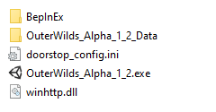
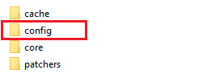
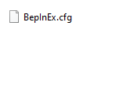
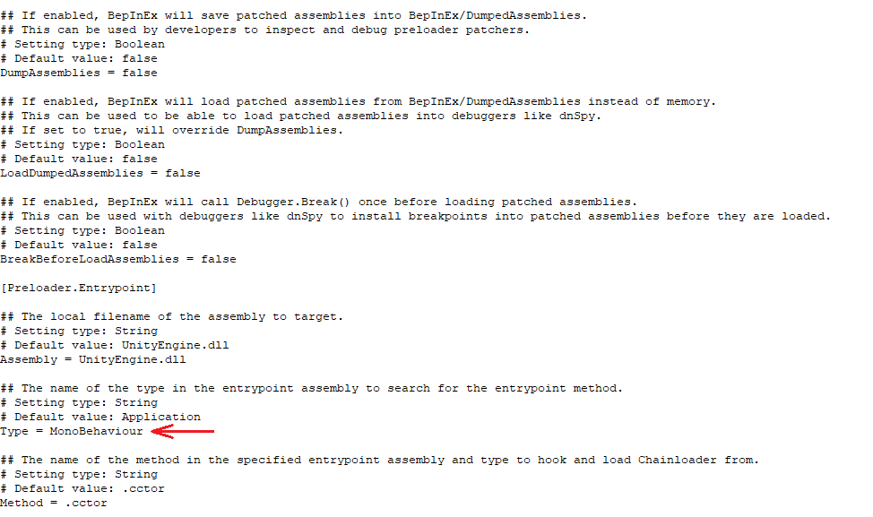
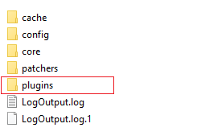
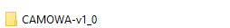
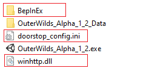

## Installing BepInEx

### Getting the files

To get the BepInEx files go to their [release page](https://github.com/BepInEx/BepInEx/releases) and download the latest release in **x86**, it will have a name simmilar to **BepInEx_x86_x.x.x.x.zip**.

Move the downloaded compressed folder into the game folder, decompress the folder and move the files from the decompressed folder into the game folder, like in the following image.

# 

### Configuring BepInEx

To configure BepInEx first you need to run the game, it will crash the first time you run it, that is an expected behaviour. After running it open the `BepInEx` folder and inside it find the `config` folder.

# 

If this folder is present, open in and you should see a file called `BepInEx.cfg`.

# 

Having this file, open it in a text editor of your preference, for this tutorial notepad++ will be used, but normal notepad should do the trick too. With it opened go to the end of the file and find a line that says `Type = Application`. You have to edit this line changing it to `Type = MonoBehaviour`, just like in the picture below. 

# 

After all this run the game again, now it shouldn't crash and new folders should appear on the `BepInEx` folder, like the `plugins` folder.

# 

## Installing Mods

To install a mod you only need to do three things:

1. Download the compressed mod folder on its release
2. Move it to `BepInEx/plugins` and decompress it there
3. Run the game

Using as an example CAMOWA, your `BepInEx/plugins` folder should look like this:
# 

## Removing Mods

To remove mods you just need to remove them from the `plugins` folder.

## Uninstalling BepInEx

To uninstall BepInEx just remove these files (`doorstop_config.ini` and `winhttp.dll`) and the `BepInEx` Folder.

# 

